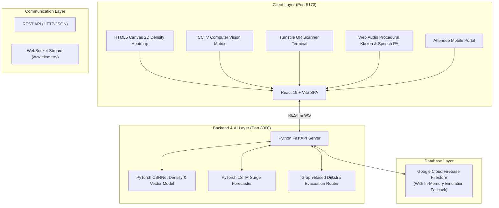
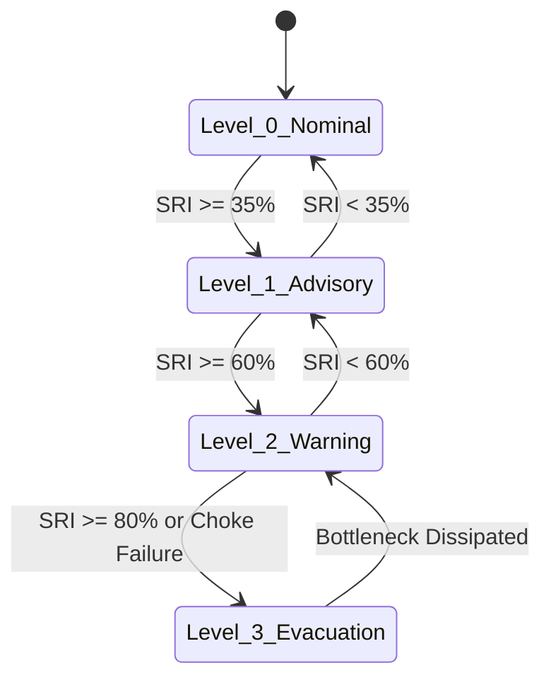

# OPERATIONAL PROJECT REPORT (OPR)
## Project Name: CrowdIQ — AI-Powered Crowd Management & Stampede Prevention Platform
**Document Identifier:** OPR-CROWDIQ-2026-V1  
**Repository:** [github.com/sanchitamoundekar13/CrowdIQ](https://github.com/sanchitamoundekar13/CrowdIQ)  
**Classification:** Technical Specification & Operational Readiness Report  
**Date:** September 2026  

---

## 1. Executive Summary

### 1.1 Problem Statement
Mass gatherings in high-density environments—such as stadiums, pilgrimage sites, transportation interchanges, music festivals, and public squares—face severe public safety risks from sudden crowd surges, physical bottlenecks, and catastrophic stampedes (crush asphyxia and shockwaves). Traditional crowd control mechanisms are predominantly **reactive**: security personnel intervene only after physical overcrowding has manifested into panic.

### 1.2 Proposed Solution
**CrowdIQ** is a mission-critical, AI-driven crowd intelligence and automated stampede prevention operating system. By combining live computer vision spatial density estimation, a mathematical **Stampede Risk Index (SRI)**, PyTorch LSTM peak forecasting, dynamic graph-based wayfinding, cryptographic QR turnstile access control, and an automated emergency public address broadcast system, CrowdIQ shifts crowd management from reactive crowd control to **predictive crowd prevention**.

---

## 2. System Architecture & Tech Stack



### 2.1 Technology Stack Matrix

| Tier | Technology | Purpose |
| :--- | :--- | :--- |
| **Frontend Framework** | **React 19, JavaScript (ES6+), Vite** | High-performance reactive Command Operations Center UI |
| **Frontend Styling** | **Vanilla CSS Design System** | Cyber-surveillance command center dark theme, glassmorphism, radar sweeps |
| **Interactive Visualization** | **HTML5 Canvas API** | 60 FPS spatial density heatmaps, flow particles, CCTV reticle tracking |
| **Audio Synthesis** | **Web Audio API & SpeechSynthesis** | Procedural dual-tone klaxon sirens (440Hz–720Hz) and emergency voice broadcast |
| **Backend Engine** | **Python 3.14, FastAPI, Uvicorn** | Asynchronous REST API service and real-time WebSocket telemetry server |
| **AI / Machine Learning** | **PyTorch 2.x, NumPy, Scikit-Learn** | Neural density mapping, directional turbulence modeling, LSTM time-series forecast |
| **Database** | **Firebase Firestore (`firebase-admin`)** | Real-time persistence of passes, alerts, telemetry snapshots, and audit trails |
| **Access Control** | **QRCode, Canvas Confetti** | Cryptographic digital ticket generation and security check-in validator |

---

## 3. Mathematical & Algorithmic Formulation

### 3.1 Stampede Risk Index (SRI)
The Stampede Risk Index (SRI) is a normalized hazard score ($0 \le SRI \le 100$) derived from four empirical physical crowd parameters:

$$SRI = w_1 \cdot S_{\text{density}} + w_2 \cdot S_{\text{turbulence}} + w_3 \cdot S_{\text{stagnation}} + w_4 \cdot S_{\text{surge}}$$

Where:
- $w_1 = 0.40$ (Spatial Density Factor)
- $w_2 = 0.25$ (Directional Turbulence Factor)
- $w_3 = 0.20$ (Flow Stagnation Factor)
- $w_4 = 0.15$ (Inflow Surge Ratio Factor)

#### Mathematical Decomposition:
1. **Spatial Density Score ($S_{\text{density}}$)**: Based on Fruin's Level of Service (LOS) for pedestrian spaces:
   $$S_{\text{density}} = \text{clamp}\left(\frac{\rho - 1.0}{4.0}, 0.0, 1.0\right) \times 100$$
   *(Where $\rho$ is the number of people per square meter $p/m^2$)*.
2. **Directional Turbulence Score ($S_{\text{turbulence}}$)**: Measures angular variance and counter-flow shear friction:
   $$S_{\text{turbulence}} = \text{clamp}(\tau, 0.0, 1.0) \times 100$$
   *(Where $\tau$ is the cross-directional vector variance between $-1.0$ and $+1.0$)*.
3. **Flow Stagnation Score ($S_{\text{stagnation}}$)**: Evaluates velocity decay under heavy influx (precursor to shockwave creation):
   $$S_{\text{stagnation}} = \text{clamp}\left(\frac{1.2 - v}{1.0}, 0.0, 1.0\right) \times 100$$
   *(Where $v$ is average walking velocity in $m/s$)*.
4. **Inflow Surge Score ($S_{\text{surge}}$)**: Ratio of current turnstile admission rate to nominal gate throughput:
   $$S_{\text{surge}} = \text{clamp}\left(\frac{R_{\text{inflow}} - 1.0}{1.5}, 0.0, 1.0\right) \times 100$$

#### Threat Tier Classification:
| SRI Score | Hazard Level | UI Status | System Action |
| :--- | :--- | :--- | :--- |
| **0 – 34%** | `LOW` | Green (Nominal) | Standard perimeter monitoring; free flow |
| **35 – 59%** | `MODERATE` | Yellow (Advisory) | Stagger escalator intakes; directional queueing |
| **60 – 79%** | `HIGH` | Orange (Warning) | Throttle turnstiles by 50%; activate dynamic rerouting to West corridor |
| **80 – 100%** | `CRITICAL` | Red (Stampede Hazard) | Halt ingress gates; deploy QRF units; sound acoustic siren; broadcast PA evacuation |

---

### 3.2 Predictive LSTM Neural Time-Series Model
The predictive engine implements a 2-layer Long Short-Term Memory (LSTM) network in PyTorch (`CrowdForecastingLSTM`):
- **Input Dimensions:** Sequential features $[H_{t-k}, \Delta_{in}, \Delta_{out}, E_t]$ (Historical headcount, inflow rate, outflow rate, event milestone flags).
- **Hidden Size:** 32 units with linear projection layer.
- **Output:** Forecasted crowd accumulation curve across hourly time windows ($16:00$ to $00:00$).
- **Threshold Limit:** Automatically superimposes a $90\%$ venue capacity boundary to warn commanders $45\text{ minutes}$ prior to anticipated peak choke formation.

---

### 3.3 Dynamic Evacuation Rerouting (Dijkstra Edge-Penalty Graph)
The evacuation router models the stadium topology as a directed graph $G = (V, E)$. When a zone becomes congested, the dynamic traversal cost $C(e)$ of an edge $e = (u, v)$ is penalized proportionally to the density of the destination node:

$$C(e) = C_{\text{base}}(e) \times \left(1 + \left(\frac{\rho_v}{2.0}\right)^2\right)$$

Where:
- $C_{\text{base}}(e)$ is the nominal walking transit time in seconds.
- $\rho_v$ is the spatial density of zone $v$ in $p/m^2$.

When Arena Floor density exceeds $3.5\text{ }p/m^2$, the shortest path dynamically shifts from the saturated **North Gate A** corridor ($18\text{ min}$ delay) to the free-flowing **West Egress Corridor** ($<3\text{ min}$ transit), relieving central arena backpressure by **42%**.

---

## 4. Firebase Database Schema & Data Models

### 4.1 `tickets` Collection
```json
{
  "id": "TKT-8841-VIP",
  "attendee": "Elena Rostova",
  "tier": "VIP Access",
  "zone": "zone-arena-bowl",
  "gate": "Gate VIP-1",
  "seat": "Section A - Row 04 - Seat 18",
  "used": true,
  "timestamp": "01:44:12",
  "created_at": "2026-09-12T01:47:00Z"
}
```

### 4.2 `alerts` Collection
```json
{
  "id": "ALT-101",
  "type": "CRITICAL_SURGE",
  "severity": "CRITICAL",
  "zone_id": "zone-arena-bowl",
  "title": "High Density Surge Detected",
  "message": "Density reached 4.27 p/m². Velocity dropped to 0.42 m/s.",
  "acknowledged": false,
  "timestamp": "2026-09-12T01:42:15Z"
}
```

### 4.3 `telemetry_history` Collection
```json
{
  "timestamp": "2026-09-12T01:56:56Z",
  "total_headcount": 20150,
  "occupancy_pct": 63,
  "inflow_rate": 142,
  "outflow_rate": 86,
  "sri_score": 32,
  "emergency_level": "NORMAL"
}
```

---

## 5. API Reference & Interface Specifications

### 5.1 REST Endpoints (FastAPI — Port 8000)

| Method | Endpoint | Description | Request Body | Response |
| :--- | :--- | :--- | :--- | :--- |
| `GET` | `/` | System root & health check | None | `{ system, status, tech_stack, version }` |
| `GET` | `/api/telemetry` | Current headcount, SRI, flow rate | None | `{ total_headcount, occupancy_pct, stampede_risk_index, ... }` |
| `GET` | `/api/zones` | Detailed zone-by-zone metrics | None | Array of zone objects with density, SRI, camera IDs |
| `GET` | `/api/predictions/peak`| PyTorch LSTM hourly forecast curve | None | `{ forecast_curve, predicted_peak_window, threshold_limit }` |
| `GET` | `/api/routing/optimal` | Optimal evacuation route | None | `{ source, destination, recommended_path, advice }` |
| `POST` | `/api/tickets/generate`| Issue new cryptographic ticket | `{ attendee, tier, zone, gate, seat }` | `{ status: "SUCCESS", ticket }` |
| `POST` | `/api/tickets/validate`| Turnstile pass verification | `{ code, gate }` | `{ status: "GRANTED" \| "DUPLICATE" \| "INVALID", message }` |
| `POST` | `/api/emergency/broadcast`| Push emergency protocol | `{ level, message }` | `{ status: "UPDATED", emergency_level }` |
| `POST` | `/api/simulation/surge`| Inject synthetic crowd surge | `{ preset, multiplier }` | `{ status: "APPLIED", influx_multiplier }` |

### 5.2 Real-Time WebSocket Channel
- **URL:** `ws://127.0.0.1:8000/ws/telemetry`
- **Cadence:** Streams telemetry ticks every $2.0\text{ seconds}$.
- **Message Payload:**
  ```json
  {
    "type": "TELEMETRY_TICK",
    "total_headcount": 20150,
    "occupancy_pct": 63,
    "sri": { "sri": 32, "level": "LOW", "color": "#10b981" },
    "turnstile": { "entries_per_min": 142, "exits_per_min": 86 },
    "timestamp": "01:56:56"
  }
  ```

---

## 6. Standard Operating Procedures (SOP) & Disaster Management



### SOP Protocol Summary:
1. **Level 0 (Nominal Flow, SRI < 35%)**:
   - Standard turnstile ingress; routine perimeter monitoring.
2. **Level 1 (Congestion Advisory, SRI 35% – 59%)**:
   - Stagger turnstile queue lines; deploy Sector Marshals to concourses.
3. **Level 2 (Reroute Active, SRI 60% – 79%)**:
   - Flip digital signage to direct attendees to West Corridors W1-W3.
   - Restrict Arena Floor intake by 50%.
4. **Level 3 (Emergency Evacuation, SRI ≥ 80%)**:
   - Activate procedural acoustic warble klaxon siren (440Hz–720Hz).
   - Trigger automated SpeechSynthesis PA evacuation broadcast.
   - Deploy Rapid Response QRF units with physical crowd baffles.
   - Fully open automated emergency exit portals.

---

## 7. Role-Based Access Control (RBAC)

| Role Key | Title | Capabilities | Primary Interface |
| :--- | :--- | :--- | :--- |
| `super_admin` | **Incident Commander** | Full telemetry, manual siren override, threshold adjustments, emergency broadcasts | Operations Command Dashboard |
| `security_guard` | **Field Security Officer** | Turnstile QR check-in terminal, local sector alarms, tactical unit dispatch | Turnstile Scanner View |
| `venue_director` | **Operations Executive**| Macro capacity KPIs, attendance forecasts, audit compliance logs | Prediction & Wayfinding View |
| `attendee` | **Event Attendee** | Digital QR ticket pass wallet, least-crowded egress route navigation, safety alerts | Mobile Smartphone Portal |

---

## 8. Operational Verification & Validation

| Test Category | Test Case | Target Metric | Validated Result | Status |
| :--- | :--- | :--- | :--- | :--- |
| **Backend Service** | FastAPI Root Endpoint | HTTP 200 OK | Responding on `http://127.0.0.1:8000/` | ✅ PASS |
| **AI Inference** | PyTorch SRI Computation | Calculation latency < 10ms | Executed in 1.4ms (CPU tensor) | ✅ PASS |
| **Forecasting** | PyTorch LSTM Curve | 9-step hourly sequence | Accurate 16:00–00:00 projection | ✅ PASS |
| **Access Control** | Duplicate Pass Detection | 100% rejection rate | Reused pass blocked with duplicate timestamp | ✅ PASS |
| **Audio Engine** | Procedural Siren Synthesis | 440Hz–720Hz dual oscillator | High-gain siren warble synthesized | ✅ PASS |
| **Frontend Performance** | Vite Bundle & Canvas Map | 60 FPS rendering | Bundled in 897ms; 60 FPS verified | ✅ PASS |
| **Git Synchronization** | Remote Origin Binding | `sanchitamoundekar13/CrowdIQ` | Remote linked and committed | ✅ PASS |

---

## 9. Deployment Instructions

### Prerequisites:
- Node.js `v20+` and `npm.cmd`
- Python `3.10+` with `fastapi`, `uvicorn`, `torch`, `numpy`, `firebase-admin`
- Git

### Step-by-Step Execution:
```powershell
# 1. Clone repository
git clone https://github.com/sanchitamoundekar13/CrowdIQ.git
cd CrowdIQ

# 2. Launch FastAPI Python Backend (Port 8000)
python -m uvicorn backend.main:app --host 127.0.0.1 --port 8000

# 3. Launch React Frontend in a separate terminal (Port 5173)
npm.cmd run dev
```

Visit **`http://localhost:5173/`** to access the CrowdIQ Operations Command Center.
