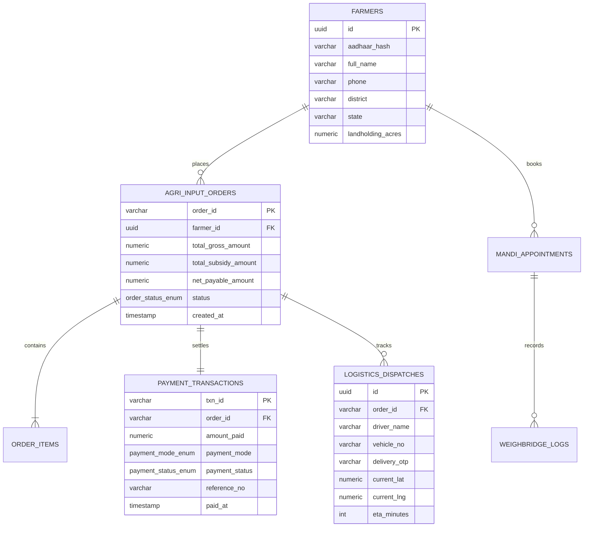

<div align="center">

# 🌾 KisanSetu (किसानसेतु)
### National MSP Procurement & Subsidized Agri-Inputs Portal
**Ministry of Agriculture & Farmers Welfare • Ministry of Chemicals & Fertilizers • Government of India**

[](https://react.dev)
[](https://www.postgresql.org/)
[](https://nodejs.org/)
[](https://dbtbharat.gov.in/)
[](https://agricoop.nic.in/)
[](LICENSE)

**Empowering Indian Farmers with Transparent MSP Crop Procurement, Subsidized Fertilizer Order Management, Multi-Modal Digital Payments, and Live GPS Fleet Tracking.**

[🌐 Explore Live Portal](https://bhavingarg121-glitch.github.io/KisanSetu/) • [📱 Direct Standalone Single-File App](https://bhavingarg121-glitch.github.io/KisanSetu/SIH_AGRICULTURE.html) • [🐘 PostgreSQL Schema](database/schema.sql)

---

</div>

## 📌 Table of Contents
- [Executive Summary & Problem Statement](#-executive-summary--problem-statement)
- [System Architecture](#-system-architecture)
- [Key Features & Modules](#-key-features--modules)
  - [1. 📦 Procurement & Payment Status Manager](#1--procurement--payment-status-manager)
  - [2. 💳 Multi-Modal Agri-Payment Gateway](#2--multi-modal-agri-payment-gateway)
  - [3. 🚚 Live Route Map & GPS Fleet Tracking](#3--live-route-map--gps-fleet-tracking)
  - [4. 🧾 Official Form 3-B Tax Invoice & Receipt](#4--official-form-3-b-tax-invoice--receipt)
  - [5. 🌾 Farmer Digital Gate Pass & Mandi Queuing](#5--farmer-digital-gate-pass--mandi-queuing)
  - [6. 🌱 Subsidized Agri-Inputs Store (PMKSK & IFFCO)](#6--subsidized-agri-inputs-store-pmksk--iffco)
  - [7. ⚖️ Mandi Terminal Operations & Automated Weighbridge](#7-️-mandi-terminal-operations--automated-weighbridge)
  - [8. 📺 Real-Time Public Yard Display Board](#8--real-time-public-yard-display-board)
  - [9. 🐘 PostgreSQL 16 Enterprise Relational Schema](#9--postgresql-16-enterprise-relational-schema)
  - [10. 📶 Offline-First PWA Synchronization](#10--offline-first-pwa-synchronization)
- [Technology Stack Matrix](#-technology-stack-matrix)
- [Database Schema & Data Models](#-database-schema--data-models)
- [REST API Endpoints](#-rest-api-endpoints)
- [Repository Structure](#-repository-structure)
- [Installation & Local Setup](#-installation--local-setup)
- [GovTech Compliance & Standards](#-govtech-compliance--standards)
- [Contributing & License](#-contributing--license)

---

## 🌟 Executive Summary & Problem Statement

In India, agriculture sustains over 55% of the national workforce. However, smallholder farmers continually face structural bottlenecks:
1. **Predatory Middlemen & Non-Transparent Procurement**: Farmers often wait days at APMC Mandis without real-time visibility into queue status or MSP rate locks.
2. **Fertilizer Black-Marketing & Arbitrary Markups**: Subsidized fertilizers (Neem-Coated Urea, DAP, MOP) are frequently hoarded, leaving marginal farmers to buy at extortionate rates without official tax invoices.
3. **Fragmented Payment Methods & Delayed Subsidies**: Lack of integrated rural payment rails (UPI QR, KCC cards, DBT e-RUPI vouchers) forces farmers into high-interest informal cash debt.
4. **Logistics Blindspots**: Once fertilizer quotas are ordered from Primary Agricultural Credit Societies (PACS), farmers receive no delivery timeline, leading to wasted transit trips.

### 💡 The Solution: KisanSetu (किसानसेतु)
**KisanSetu** is an end-to-end, digital governance platform engineered for the **Smart India Hackathon (SIH 2026)**. It unifies **MSP procurement token management**, **subsidized fertilizer sales (PMKSK)**, **multi-modal payments**, **live delivery GPS routing**, and **audit-ready PostgreSQL relational tracking** into a unified, GIGW 3.0-compliant portal.

---

## 🏗️ System Architecture

```mermaid
graph TD
    subgraph "Farmer / Public Layer"
        F[🌾 Farmer Smartphone / CSC Center] -->|Book Mandi Token & Buy Agri-Inputs| UI[Web Portal / Standalone Single-File PWA]
        MandiDisplay[📺 Public Mandi Yard Display Board] <--|Real-Time Queue WebSocket| SVR[Node.js / Express REST API]
    end

    subgraph "KisanSetu Core Platform"
        UI -->|React 18 Context State| PM[📦 Procurement & Payment Manager]
        UI -->|Dynamic QR / KCC / e-RUPI| PG[💳 Multi-Modal Payment Gateway]
        UI -->|SVG Map & Waypoint Telemetry| GPS[🚚 Live GPS Route Tracker]
        UI -->|Form 3-B Invoice Generation| INV[🧾 Cryptographic Tax Invoice Engine]
        UI -->|Offline Queue Sync| SW[📶 Service Worker & IndexedDB]
    end

    subgraph "Backend & Processing Layer"
        PM & PG & GPS -->|REST API Requests| SVR
        SVR -->|Parameterized Queries & Triggers| DB[(🐘 PostgreSQL 16 Enterprise Relational DB)]
        SVR -->|Payment Webhook & Status Callbacks| NPCI[🇮🇳 NPCI / PFMS / DBT Bharat Gateway]
    end

    subgraph "Logistics & Physical Mandi Infrastructure"
        SVR -->|Gate Pass Validation| MandiOps[⚖️ Mandi Terminal & Automated Weighbridge]
        SVR -->|Dispatch Notification| PACS[🏢 Primary Agricultural Credit Societies - PACS Depot]
        PACS -->|GPS Telemetry Updates| GPS
    end
```

---

## 🚀 Key Features & Modules

### 1. 📦 Procurement & Payment Status Manager
- **Complete Order Lifecycle Tracking**: Full visibility into fertilizer purchases across 5 structured stages:
  - `Pending Payment` ➔ `Processing / PACS Allocated` ➔ `In Transit / Dispatched` ➔ `Delivered` ➔ `Cancelled / Refunded`.
- **Category & Search Filters**: Filter purchases by fertilizer type (Urea, DAP, MOP, Bio-NPK, Zinc Sulfate, Micronutrients) or query by Order ID / Token Number.
- **Real-Time KPI Cards**:
  - Total Procurement Value (₹)
  - Central Government Subsidies Claimed (₹)
  - Total Agri-Inputs Volume Procured (Quintals / Bags)
  - Pending Action Count

---

### 2. 💳 Multi-Modal Agri-Payment Gateway
Integrated rural digital payment gateway with failover simulation and instant transaction receipts:
- **Dynamic UPI QR Code**: Real-time generated QR with dynamic transaction reference (`UPI-AGRI-...`), bank resolution metadata, and a live **5-minute countdown expiry timer**.
- **Kisan Credit Card (KCC) RuPay**: Subsidized credit line checkout featuring automatic 4% interest subvention validation and CVV verification.
- **DBT e-RUPI Digital Vouchers**: Ministry of Finance purpose-bound vouchers redeemable solely at certified PMKSK input centers.
- **Net Banking / PFMS Integration**: Direct interbank settlement via NEFT/RTGS with Public Financial Management System tracking.
- **Cash on Delivery (COD) / PACS Pay**: Guaranteed delivery verification with physical collection at the village cooperative society.

---

### 3. 🚚 Live Route Map & GPS Fleet Tracking
- **Interactive SVG Vector Map**: Visualizes the logistics transit route from the **PACS Fertilizer Depot** to the farmer's registered land parcel.
- **Animated GPS Delivery Vehicle**: Dynamic speedometer (`km/h`), heading angle, and progressive waypoint path.
- **Driver & Dispatch Telemetry**: Driver name, contact phone, vehicle registration plate (e.g., *MH-31-AG-8821*), and dynamic ETA updates.
- **Tamper-Proof Delivery OTP**: 4-digit verification code sent to the farmer's mobile phone, required by the delivery agent to confirm handover.

---

### 4. 🧾 Official Form 3-B Tax Invoice & Receipt
- **Government Compliance**: Follows the Ministry of Chemicals & Fertilizers standard format for subsidized sale records.
- **Central Subsidy Breakdown**: Explicit breakdown of Gross Market Value, Central Government Direct Subsidy, and Farmer Net Payable Amount.
- **Cryptographic QR Code**: Encodes transaction timestamp, PFMS voucher ID, order hash, and GST registration number.
- **One-Click Print & PDF Export**: Instant printable receipt for farmer accounting and local PACS verification.

---

### 5. 🌾 Farmer Digital Gate Pass & Mandi Queuing
- **MSP Crop Token Generation**: Farmers book guaranteed delivery slots to prevent physical Mandi congestion during harvest peaks.
- **QR Gate Pass**: Encodes farmer registration number, crop type (Wheat, Paddy, Mustard, Soybean), estimated weight, and designated entry gate.
- **Multi-Channel Dispatch**: Direct print pass, instant SMS confirmation, and WhatsApp PDF delivery.

---

### 6. 🌱 Subsidized Agri-Inputs Store (PMKSK & IFFCO)
- **Subsidized Price Assurance**: Neem-Coated Urea (₹266.50 / 45kg bag), DAP (₹1,350 / 50kg bag), MOP, Bio-Fertilizers.
- **Aadhaar-Linked Quota Enforcement**: Protects against hoarding by enforcing landholding-based purchase limits.
- **Interactive Cart & Checkout**: Real-time subsidy calculation during order assembly.

---

### 7. ⚖️ Mandi Terminal Operations & Automated Weighbridge
- **Weighbridge Integration**: Gross weight and tare weight capture with automatic net crop weight determination.
- **Quality Inspection & Deductions**: Moisture content percentage calculation with automated standard moisture deduction rules.
- **MSP Rate Calculation**: Multiplies certified net weight by official Government MSP rates for instantaneous payment clearance.

---

### 8. 📺 Real-Time Public Yard Display Board
- **Transparency for Farmers**: Full-screen public display board designed for Mandi yard LED screens.
- **Live Token Queue Status**: Shows Calling Token, In-Weighing Token, and Waiting Count.
- **Daily MSP Rate Ticker**: Real-time ticker for Wheat, Paddy, Cotton, Mustard, and Pulses.
- **Bilingual Announcements**: English and हिन्दी display mode with audio chime alerts.

---

### 9. 🐘 PostgreSQL 16 Enterprise Relational Schema
- **Production DDL (`database/schema.sql`)**: Robust enterprise database structure with constraints, foreign keys, triggers, and indexes.
- **Live Telemetry Ribbon**: Real-time connection indicator in the portal header verifying database responsiveness.

---

### 10. 📶 Offline-First PWA Synchronization
- **Rural Connectivity Architecture**: Operates seamlessly in intermittent or zero-connectivity village environments.
- **Synchronization Queue**: Staged orders, weighbridge logs, and gate passes are stored locally in IndexedDB and automatically synced once 4G/Wi-Fi is re-established.

---

## 💻 Technology Stack Matrix

| Layer | Technologies | Architectural Function |
| :--- | :--- | :--- |
| **Frontend Framework** | React 18, React DOM | Declarative component hierarchy and Context API global state |
| **Styling & Theme** | Tailwind CSS CDN | High-performance GovTech design system with high-contrast accessibility |
| **Icons & Media** | Lucide React | Clean, scalable SVG icons for agricultural and financial indicators |
| **QR Generation** | QRCode.js / SVG Canvas | Instant rendering of UPI and Gate Pass cryptographic QR codes |
| **Logistics Visuals** | SVG Vector Canvas | Lightweight, GPU-accelerated interactive fleet route map |
| **Backend API** | Node.js, Express.js | High-throughput REST API serving orders, payments, and mandi queues |
| **Database** | PostgreSQL 16.2 | ACID-compliant relational storage for financial orders and audit trails |
| **Deployment** | GitHub Pages / Vercel | Zero-configuration continuous delivery via GitHub Actions |

---

## 🗄️ Database Schema & Data Models

The relational schema is defined in [`database/schema.sql`](database/schema.sql) and initialized with seed data in [`database/seed.sql`](database/seed.sql):



---

## 🔌 REST API Endpoints

The included backend REST server provides comprehensive endpoints documented below:

| Method | Endpoint | Description |
| :--- | :--- | :--- |
| `GET` | `/api/orders` | Retrieve list of farmer fertilizer orders with optional status filter |
| `GET` | `/api/orders/:id` | Get detailed record of a specific procurement order and items |
| `POST` | `/api/orders` | Create a new fertilizer purchase order with Aadhaar quota validation |
| `POST` | `/api/orders/:id/pay` | Process payment settlement (UPI, KCC, e-RUPI, NetBanking, COD) |
| `GET` | `/api/orders/:id/status`| Poll live dispatch and logistics tracking status |
| `GET` | `/api/postgres/status` | Health check endpoint returning live PostgreSQL connection telemetry |
| `GET` | `/api/mandi/tokens` | Get live Mandi queue tokens and gate pass bookings |
| `POST` | `/api/mandi/weigh` | Record weighbridge gross/tare metrics and calculate MSP payout |

---

## 📁 Repository Structure

```
KisanSetu/
├── SIH_AGRICULTURE.html          # Standalone single-file production web app (Open in any browser)
├── index.html                    # Root web entrypoint for GitHub Pages deployment
├── 404.html                      # Single Page Application rewrite fallback
├── agriculture.html              # Dedicated mirror entrypoint
├── kisansetu.html                # Branded alias entrypoint
│
├── database/                     # Enterprise Relational Database Layer
│   ├── README.md                 # PostgreSQL installation and provisioning guide
│   ├── schema.sql                # Complete PostgreSQL 16 DDL, triggers, and indexes
│   └── seed.sql                  # Production seed data (orders, farmers, inventory)
│
├── server/                       # Node.js / Express Backend Layer
│   ├── package.json              # Backend dependencies
│   ├── server.js                 # Express server configuration
│   ├── routes/
│   │   └── api.js                # Order, payment, and mandi API routes
│   └── services/
│       ├── queueService.js       # Mandi queuing algorithm
│       └── recommendationService.js # Crop and fertilizer advisory
│
├── public/                       # Static distribution assets
│   ├── favicon.svg               # Emblem favicon
│   └── _redirects                # Cloudflare/Netlify SPA rewrite rules
│
├── vite.config.js                # Build configuration with universal relative base
├── package.json                  # Frontend scripts and tooling
└── README.md                     # Comprehensive KisanSetu Project Documentation
```

---

## 🚀 Installation & Local Setup

### Option 1: Instant Run (Zero Dependencies)
You do not need Node.js or PostgreSQL installed to test the complete user interface:
1. Double click or open [`SIH_AGRICULTURE.html`](SIH_AGRICULTURE.html) directly in any web browser (Chrome, Edge, Firefox, Safari).
2. The entire application runs client-side with all modules, interactive payments, and simulated live database telemetry.

---

### Option 2: Run with Vite Dev Server
```powershell
# 1. Clone the repository
git clone https://github.com/bhavingarg121-glitch/KisanSetu.git
cd KisanSetu

# 2. Install dependencies
npm install

# 3. Start local development server
npm run dev
```
Open **`http://localhost:5173/`** to view the live portal.

---

### Option 3: Full-Stack Execution with PostgreSQL
```powershell
# 1. Provision PostgreSQL Database
psql -U postgres -d postgres -f database/schema.sql
psql -U postgres -d postgres -f database/seed.sql

# 2. Start Express API Backend (Port 5000)
cd server
npm install
npm start

# 3. Start Frontend in another terminal
cd ..
npm run dev
```

---

## 🇮🇳 GovTech Compliance & Standards

- **GIGW 3.0 (Guidelines for Indian Government Websites)**: Proper National Emblem positioning, bilingual language switch (English & हिन्दी), official typography, and high-contrast color palette.
- **W3C WCAG 2.1 AA**: Full keyboard accessibility, descriptive ARIA attributes, and accessible font scaling.
- **Direct Benefit Transfer (DBT) Bharat**: Compliant with Aadhaar-authenticated fertilizer subsidy disbursement standards.
- **PFMS (Public Financial Management System)**: Compatible with Central Sector fertilizer subsidy accounting formats.

---

## 👥 Authors & Hackathon Team

- **Repository**: [https://github.com/bhavingarg121-glitch/KisanSetu](https://github.com/bhavingarg121-glitch/KisanSetu)
- **Collaborator**: `sanchitamoundekar13`
- **Smart India Hackathon (SIH 2026)** — Ministry of Agriculture & Farmers Welfare Category

---

## 📜 License
Distributed under the **MIT License**. See `LICENSE` for more information.
