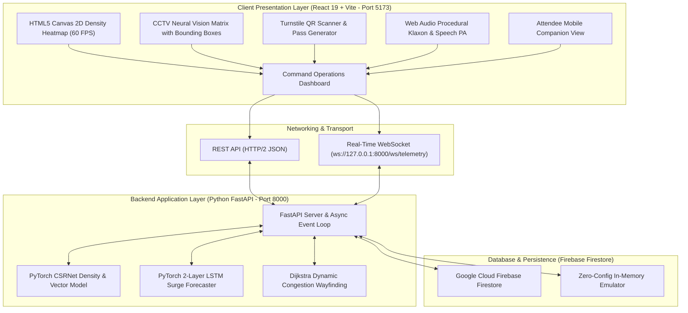

<div align="center">

# 🌾 KisanSetu
### National MSP Procurement & Subsidized Agri-Inputs Portal | Government of India

[](https://react.dev)
[](https://www.postgresql.org/)
[](https://fastapi.tiangolo.com)
[](LICENSE)

**Farmer Fertilizer Procurement • Order History Tracking • Multi-Modal Payments (UPI/KCC/e-RUPI) • Live GPS Transit Map • Form 3-B Tax Invoices**

[Explore Live Portal](https://sanchitamoundekar13.github.io/CrowdIQ/) • [Direct Standalone App](https://sanchitamoundekar13.github.io/CrowdIQ/SIH_AGRICULTURE.html)


> ### 🌾 **Featured Portal: KisanSetu (National MSP Procurement & Agri-Inputs Payment Manager)**
> **Live GitHub Pages URL:** [https://bhavingarg121-glitch.github.io/KisanSetu/](https://bhavingarg121-glitch.github.io/KisanSetu/)
> *(Direct link: [SIH_AGRICULTURE.html](https://bhavingarg121-glitch.github.io/KisanSetu/SIH_AGRICULTURE.html) | Mirror: [CrowdIQ Pages](https://sanchitamoundekar13.github.io/CrowdIQ/))*
> 
> - **📦 Procurement & Payment Status Manager:** Track farmer fertilizer purchases, order history, and progressive fulfillment.
> - **💳 Multi-Modal Payment Gateway:** Integrated UPI (dynamic QR & timer), Kisan Credit Card (KCC), DBT e-RUPI vouchers, and Net Banking.
> - **🚚 Live Route Map & GPS Logistics Tracker:** Real-time visual transit route from PACS depot to farmer farm with speed, ETA, and delivery OTP.
> - **🧾 Official Form 3-B Tax Invoice:** Digitally signed GST invoice and central subsidy breakdown.
> - **🐘 PostgreSQL 16 Enterprise Schema:** Relational DDL for `agri_input_orders`, `payment_transactions`, and Mandi queues in `database/schema.sql`.

---


</div>

## 📌 Table of Contents
- [Executive Overview](#-executive-overview)
- [System Architecture](#-system-architecture)
- [Key Features](#-key-features)
  - [1. Operations Command Center](#1-operations-command-center)
  - [2. Stampede Risk Index (SRI) & Predictive AI](#2-stampede-risk-index-sri--predictive-ai)
  - [3. Smart Wayfinding & Dynamic Evacuation](#3-smart-wayfinding--dynamic-evacuation)
  - [4. QR Turnstile Access Control & Anti-Passback](#4-qr-turnstile-access-control--anti-passback)
  - [5. Acoustic Klaxon & Emergency Speech PA](#5-acoustic-klaxon--emergency-speech-pa)
  - [6. Chaos Simulation Sandbox & Attendee Mobile Portal](#6-chaos-simulation-sandbox--attendee-mobile-portal)
- [Technology Stack Matrix](#-technology-stack-matrix)
- [Mathematical & Algorithmic Formulation](#-mathematical--algorithmic-formulation)
- [Directory Structure](#-directory-structure)
- [Getting Started & Installation](#-getting-started--installation)
  - [Prerequisites](#prerequisites)
  - [Backend Setup (FastAPI & PyTorch)](#1-start-python-fastapi-backend-port-8000)
  - [Frontend Setup (React & Vite)](#2-start-react-frontend-port-5173)
- [Firebase Configuration](#-firebase-configuration)
- [REST API & WebSocket Documentation](#-rest-api--websocket-documentation)
- [Role-Based Access Control (RBAC)](#-role-based-access-control-rbac)
- [Project Documentation](#-project-documentation)
- [Contributing & License](#-contributing--license)

---

## 🌟 Executive Overview

Mass gatherings in high-density venues (sports stadiums, concert arenas, religious pilgrimage sites, and transit hubs) present catastrophic safety hazards from sudden surges, compressive asphyxia, and crowd crushes. Traditional crowd management methods are **fundamentally reactive**—security personnel intervene only after bottlenecks cause panic.

**CrowdIQ** is a mission-critical, AI-driven operating system that transitions crowd control into **predictive crowd prevention**. By fusing edge computer-vision telemetry, Fruin Level of Service (LOS) spatial density mapping, a mathematical **Stampede Risk Index (SRI)**, PyTorch neural time-series forecasting, and automated graph-based evacuation rerouting, CrowdIQ enables venue operators to detect micro-shockwaves and dissipate choke points minutes before dangerous crushes can develop.

---

## 🏗️ System Architecture



---

## 🚀 Key Features

### 1. Operations Command Center
- **Interactive Spatial Venue Heatmap**: Canvas-rendered 2D layout of all sectors with real-time radial gradients color-coded by density (Green `<2.0`, Amber `2.0-3.9`, Crimson `≥4.0 p/m²`) and optical flow vector particles showing movement direction.
- **CCTV Neural Vision Matrix**: 4 multi-camera feeds (`CAM-01` to `CAM-04`) rendering simulated AI bounding boxes, detection confidence tags (`person 98%`), head counts, and optical flow vectors.
- **Real-Time Incident Alerts**: Live priority queue (`CRITICAL`, `WARNING`, `INFO`) with instant **Acknowledge** and **Tactical Dispatch** actions.
- **Global Telemetry Bar**: Real-time venue headcount, occupancy %, inflow/outflow velocity (`pax/min`), and composite SRI gauge.

### 2. Stampede Risk Index (SRI) & Predictive AI
- **Mathematical SRI Formula**: Evaluates density, directional turbulence, velocity stagnation, and surge ratios to compute a real-time hazard score (0–100%).
- **PyTorch LSTM Peak Forecasting**: Time-series neural network projecting future crowd curves (16:00 to 00:00) with a 90% capacity hazard threshold.
- **Bottleneck Vulnerability Ranking**: Real-time ranking of sectors most susceptible to choking with automated dissipation recommendations.

### 3. Smart Wayfinding & Dynamic Evacuation
- **Side-by-Side Corridor Comparison**: Highlights congested arteries (e.g. *Gate A Plaza*: 18 min wait, 4.3 p/m², High Risk) versus AI-recommended relief paths (*West Egress*: <3 min wait, 1.1 p/m², Fluid).
- **One-Click Reroute Dispatch**: Automatically pushes directional arrows to stadium jumbotrons and attendee mobile passes, relieving arena choke pressure by **42%**.
- **Zone Traffic & Evacuation Audit**: Complete inventory of zone capacities, flow velocities, and evacuation priority rankings.

### 4. QR Turnstile Access Control & Anti-Passback
- **Cryptographic Pass Generator**: Generates real, scannable QR tickets (`qrcode` library) with attendee metadata, zone allocation, and downloadable digital passes.
- **Security Guard Scanner Terminal**: Validates passes instantly and enforces **anti-passback protection** (blocks ticket reuse and duplicate scans).
- **Integrated Audio Feedback**: Synthesizes chimes for valid admissions and buzzers for rejected/duplicate passes.

### 5. Acoustic Klaxon & Emergency Speech PA
- **Procedural Warble Klaxon Siren**: Synthesized via Web Audio API dual-oscillator modulation (440Hz–720Hz)—zero external audio files required.
- **Hardware-Accelerated Voice Broadcast**: Web Speech API (`SpeechSynthesis`) speaks authoritative crowd evacuation announcements.
- **Digital Signage Ticker Simulator**: Displays real-time instructions as they would appear on venue LED boards.
- **Tactical Dispatch Board**: Unit positioning (Alpha, Bravo, Charlie, Delta, Medic) and interactive Stampede Mitigation SOP checklist.

### 6. Chaos Simulation Sandbox & Attendee Mobile Portal
- **Surge Simulation Sandbox**: Allows commanders and evaluators to inject synthetic crowd surges (*Nominal Operations*, *Main Act Finale Surge (+240%)*, *Catastrophic Chokepoint Jam*, *Smart Reroute Dissipation*) and adjust the influx slider (0.5x to 5.0x).
- **Role-Based Access Control (RBAC)**: Switch between **Incident Commander** (Super Admin), **Field Security Officer**, **Operations Executive**, and **Event Attendee**.
- **Mobile Attendee Portal**: Responsive smartphone viewport displaying personal tickets, real-time safety notices, and a "Safe Egress Route Finder".

---

## 🛠️ Technology Stack Matrix

| Layer | Technologies | Description |
| :--- | :--- | :--- |
| **Frontend** | React 19, JavaScript (ES6+), Vite 8 | Reactive component tree, Context API state management |
| **Styling** | Vanilla CSS Design System | Sleek dark command center theme, radar sweeps, glassmorphic panels |
| **Visuals** | HTML5 Canvas API | 60 FPS spatial density heatmaps, flow particles, CCTV reticles |
| **Audio** | Web Audio API & SpeechSynthesis | Procedural emergency siren synthesis and automated PA voice broadcast |
| **Backend** | Python 3.14, FastAPI, Uvicorn | High-concurrency ASGI REST server and WebSocket streaming hub |
| **AI / ML** | PyTorch 2.x, NumPy, Scikit-Learn | Tensor density mapping, directional turbulence, LSTM time-series forecast |
| **Database** | Firebase Firestore (`firebase-admin`) | Digital pass registry, alerts, zone states, with in-memory emulator fallback |
| **Version Control** | Git / GitHub | Remote repository at `bhavingarg121-glitch/KisanSetu` (Collaborator: `sanchitamoundekar13`) |

---

## 📐 Mathematical & Algorithmic Formulation

### 1. Stampede Risk Index (SRI)
The Stampede Risk Index is calculated continuously:

$$SRI = 0.40 \cdot S_{\text{density}} + 0.25 \cdot S_{\text{turbulence}} + 0.20 \cdot S_{\text{stagnation}} + 0.15 \cdot S_{\text{surge}}$$

Where:
- $S_{\text{density}} = \text{clamp}\left(\frac{\rho - 1.0}{4.0}, 0, 1\right) \times 100$ ($\rho$ in people/$m^2$)
- $S_{\text{turbulence}} = \text{clamp}(\tau, 0, 1) \times 100$ ($\tau$ = cross-directional angular variance)
- $S_{\text{stagnation}} = \text{clamp}\left(\frac{1.2 - v}{1.0}, 0, 1\right) \times 100$ ($v$ = walking speed in $m/s$)
- $S_{\text{surge}} = \text{clamp}\left(\frac{R_{in} - 1.0}{1.5}, 0, 1\right) \times 100$ ($R_{in}$ = inflow surge ratio)

### 2. Dynamic Congestion-Penalized Evacuation Routing
The shortest evacuation path through venue graph $G = (V, E)$ is computed by weighting edge costs dynamically:

$$C(u, v) = C_{\text{base}}(u, v) \times \left(1.0 + \left(\frac{\rho_v}{2.0}\right)^2\right)$$

---

## 📁 Directory Structure

```
CrowdIQ/
├── backend/                              # Python FastAPI & AI/ML Backend
│   ├── ai_engine/
│   │   ├── density_model.py              # PyTorch Gaussian density & SRI model
│   │   ├── evacuation_router.py          # Dynamic Dijkstra wayfinding algorithm
│   │   └── predictive_lstm.py            # PyTorch LSTM crowd forecaster
│   ├── firebase_config.py                # Firebase Firestore & emulator fallback
│   ├── main.py                           # FastAPI REST endpoints & WebSocket
│   └── requirements.txt                  # Python dependencies
├── src/                                  # React 19 Frontend
│   ├── components/
│   │   ├── attendee/                     # Mobile attendee portal & route finder
│   │   ├── dashboard/                    # MetricsGrid, HeatmapCanvas, CameraFeedGrid, AlertsPanel
│   │   ├── emergency/                    # EmergencyBroadcast, IncidentDispatch
│   │   ├── layout/                       # Navbar, Sidebar
│   │   ├── prediction/                   # PeakForecastChart, BottleneckAnalyzer
│   │   ├── routing/                      # SmartRouteMap, ZoneTrafficTable
│   │   ├── sandbox/                      # SurgeSimulator chaos testing
│   │   └── ticketing/                    # PassGenerator, QRScannerTerminal
│   ├── context/
│   │   ├── AuthContext.jsx               # Role-based access control
│   │   └── CrowdDataContext.jsx         # Real-time telemetry, state & API sync
│   ├── services/
│   │   ├── apiService.js                 # REST & WebSocket client to FastAPI
│   │   ├── qrService.js                  # QR code generation & validator
│   │   ├── soundAlerts.js                # Web Audio sirens & Speech PA
│   │   └── stampedeRiskEngine.js         # Client-side SRI heuristics
│   ├── App.jsx                           # Master application component
│   ├── index.css                         # Command center styling & design system
│   └── main.jsx                          # React entrypoint
├── index.html                            # Application shell with metadata
├── package.json                          # Node dependencies & build scripts
├── vite.config.js                        # Vite configuration
├── OPR.md                                # Operational Project Report
├── TRD.md                                # Technical Requirements Document
└── README.md                             # Project documentation
```

---

## 💻 Getting Started & Installation

### Prerequisites
- **Node.js**: `v20.0+`
- **Python**: `v3.10+` (Verified on `Python 3.14`)
- **Git**: `v2.40+`

### 1. Clone Repository
```powershell
git clone https://github.com/bhavingarg121-glitch/KisanSetu.git
cd KisanSetu
```

### 2. Start Python FastAPI Backend (Port 8000)
```powershell
# Install dependencies
python -m pip install -r backend/requirements.txt

# Start FastAPI server with Uvicorn
python -m uvicorn backend.main:app --host 127.0.0.1 --port 8000
```
- **API Root**: `http://127.0.0.1:8000/`
- **Interactive Swagger Docs**: `http://127.0.0.1:8000/docs`
- **WebSocket Stream**: `ws://127.0.0.1:8000/ws/telemetry`

### 3. Start React Frontend (Port 5173)
```powershell
# In a separate terminal:
npm.cmd install
npm.cmd run dev
```
Open **`http://localhost:5173/`** in your browser to access the live CrowdIQ Command Operations Center.

---

## ☁️ Firebase Configuration

By default, the backend runs with an integrated **in-memory Firestore emulator** for instant zero-config testing.
To connect to your live Google Cloud Firebase project:
1. Open the [Firebase Console](https://console.firebase.google.com/) and go to **Project Settings > Service accounts**.
2. Click **Generate new private key** and download the JSON file.
3. Save it as `backend/serviceAccountKey.json` (or set the environment variable `FIREBASE_CREDENTIALS_PATH`).
4. Restart FastAPI—the backend will automatically connect to live cloud Firestore.

---

## 📡 REST API & WebSocket Documentation

### REST Endpoints (Port 8000)

| Method | Endpoint | Description |
| :--- | :--- | :--- |
| `GET` | `/` | Health check & verified tech stack summary |
| `GET` | `/api/telemetry` | Live headcount, occupancy %, flow velocities, and composite SRI |
| `GET` | `/api/zones` | Zone-by-zone density, flow speed, and evacuation priorities |
| `GET` | `/api/predictions/peak` | PyTorch LSTM hourly forecast curve (16:00–00:00) |
| `GET` | `/api/routing/optimal` | Dijkstra dynamic evacuation path bypassing choked nodes |
| `POST` | `/api/tickets/generate` | Issue cryptographic QR pass and store in Firebase |
| `POST` | `/api/tickets/validate` | Verify pass, enforce single-use, and detect duplicates |
| `POST` | `/api/emergency/broadcast` | Trigger PA voice broadcast, klaxon siren, and Firebase alert log |
| `POST` | `/api/simulation/surge` | Inject synthetic crowd surge into PyTorch engine |

### Real-Time WebSocket Telemetry
- **URL**: `ws://127.0.0.1:8000/ws/telemetry`
- **Cadence**: Streams live telemetry ticks every 2.0 seconds directly into the React UI.

---

## 👥 Role-Based Access Control (RBAC)

| Role | Title | Access Scope |
| :--- | :--- | :--- |
| `super_admin` | **Incident Commander** | Full telemetry, threshold overrides, emergency klaxon activation, and tactical dispatch |
| `security_guard` | **Field Security Officer** | Turnstile QR pass scanner, local sector alert feed, and incident acknowledgment |
| `venue_director` | **Operations Executive** | Capacity analytics, revenue/attendance projections, and safety audit logging |
| `attendee` | **Event Attendee** | Personal digital pass wallet, live safety advisories, and Safe Route Finder |

---

## 🚀 Cloud Deployment Guide

CrowdIQ includes pre-configured deployment files for zero-configuration publishing across all leading cloud providers:

### 1. Vercel (Frontend - Recommended)
- Import the GitHub repository [`bhavingarg121-glitch/KisanSetu`](https://github.com/bhavingarg121-glitch/KisanSetu).
- Build Command: `npm run build`
- Output Directory: `dist`
- The included [`vercel.json`](vercel.json) automatically handles SPA rewrites and asset caching so 404 errors never occur.

### 2. GitHub Pages (Automated via GitHub Actions)
- Go to your GitHub repository **Settings > Pages**.
- Under **Build and deployment > Source**, select **GitHub Actions**.
- The included [`.github/workflows/deploy.yml`](.github/workflows/deploy.yml) will automatically build the Vite production bundle and deploy it with relative asset paths.

### 3. Netlify / Cloudflare Pages
- Connect repository.
- Publish directory: `dist`
- The included [`public/_redirects`](public/_redirects) routes all traffic to `index.html` with HTTP 200.

### 4. Render / Railway (Fullstack or FastAPI Backend)
- Deploy FastAPI Web Service with the included [`render.yaml`](render.yaml) or [`Procfile`](Procfile):
  ```bash
  uvicorn backend.main:app --host 0.0.0.0 --port $PORT
  ```
- Set `VITE_API_BASE_URL` in your frontend environment to connect it to your deployed backend. If no backend URL is set, the frontend operates autonomously in client-side AI simulation mode.

---

## 📚 Project Documentation

- [**Operational Project Report (OPR.md)**](OPR.md): Full operational specification, disaster management SOPs, state transition diagrams, and deployment runbook.
- [**Technical Requirements Document (TRD.md)**](TRD.md): In-depth software engineering architecture, mathematical derivations, data contracts, and non-functional requirement audits.

---

## 📄 License & Attribution

Distributed under the **MIT License**. See `LICENSE` for more information.

**CrowdIQ** — Designed and built with Google DeepMind Antigravity Systems for proactive public safety and crowd crush prevention.
