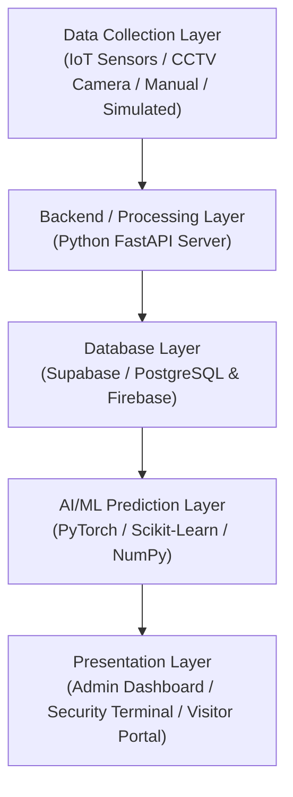

# TECHNICAL DESIGN REPORT (TDR)

## Project Title
**CrowdPulse: AI-Powered Crowd Management and Safety System**

---

## 1. Introduction
**CrowdPulse** is an intelligent crowd management and safety system designed to monitor, analyse and manage crowds in public places and large events. The system provides real-time information about crowd density in different zones and helps authorities identify overcrowded areas. It generates alerts when the number of people in a zone approaches or exceeds its predefined capacity. The system can also use historical crowd data and AI/ML techniques to predict future crowd conditions. Based on the crowd situation, it can recommend alternative gates or routes to improve crowd movement and safety.

---

## 2. Problem Definition
Large gatherings such as festivals, railway stations, stadiums, exhibitions and college events can experience sudden increases in crowd density. Manual monitoring may not provide authorities with sufficient information or response time. Overcrowding can result in congestion, long waiting times and potentially dangerous situations (including stampedes and crowd crushes).

The proposed system addresses this problem by providing a centralized platform for monitoring crowd density, detecting critical zones, generating alerts and assisting authorities in making quick decisions.

---

## 3. Objectives
The main objectives of CrowdPulse are:
1. To monitor the number of people present in different zones in real time.
2. To classify zones according to their crowd density.
3. To detect overcrowding and generate real-time alerts.
4. To monitor entry and exit movements.
5. To store crowd data for future analysis.
6. To predict possible crowd increases using AI/ML.
7. To recommend alternative routes or gates.
8. To provide an easy-to-use dashboard for administrators and security personnel.
9. To provide useful crowd information to visitors.
10. To optionally integrate IoT sensors for collecting real-world crowd data.

---

## 4. Proposed System
CrowdPulse consists of a frontend application, backend server, database and an optional IoT/data collection layer.

The system receives crowd information from sensors, cameras, manual inputs or simulated data. The backend processes the received information and compares the current crowd with the predefined capacity of each zone.

The system classifies the crowd into different levels:
* **🟢 Green – Safe:** Crowd is within the safe limit.
* **🟡 Yellow – Moderate:** Crowd is increasing and requires attention.
* **🔴 Red – Critical:** Crowd is near or above the maximum safe capacity.

When a critical condition is detected, an alert is automatically generated for the administrator or security personnel.

---

## 5. System Architecture



### 5.1 Data Collection Layer
Crowd data may be collected through:
* IoT sensors (ESP32, ultrasonic, IR counters)
* Camera / computer vision edge feeds
* Manual entry / turnstile taps
* Simulated data during development and testing

### 5.2 Backend Layer
The backend receives and processes the data. It performs tasks such as:
* Updating live crowd counts
* Checking capacity limits and calculating density ($p/m^2$)
* Generating real-time alerts
* Managing users and role-based permissions
* Sending real-time telemetry to the frontend via REST and WebSockets

### 5.3 Database Layer
The database stores:
* User information and credentials
* Zone definitions and capacities
* Crowd counts and historical records
* Entry/exit turnstile records
* Alert logs and emergency broadcasts
* Event metadata and scheduling information

### 5.4 AI/ML Layer
Historical crowd data is analysed to predict future crowd density, identify possible overcrowding, and compute dynamic shortest evacuation routes.

### 5.5 Presentation Layer
The frontend displays the processed information through:
* Centralized Operations Dashboard
* Interactive 2D Crowd Density Heatmap (HTML5 Canvas 60 FPS)
* CCTV Neural Vision Matrix with Bounding Boxes
* Real-time Alert Drawer
* Smart Route Recommendations
* Historical Analytics and Charts

---

## 6. Major Modules

### Module 1: User Authentication & Role Management
Users can log in according to their assigned role:
* **Admin / Incident Commander:** Full telemetry, emergency override, and parameter controls.
* **Security Staff:** Turnstile pass scanning, sector alarms, and tactical unit dispatch.
* **Visitor:** Mobile pass view, safe route finder, and real-time crowd status.

### Module 2: Crowd Monitoring
The system displays the current crowd count for each zone.
* *Example:*
  * **Zone A (Plaza) → 750 / 1000 people → Safe 🟢**
  * **Zone B (Arena Floor) → 1450 / 1500 people → Critical 🔴**

### Module 3: Zone Management
Admin can create and manage different zones and define:
* Zone name and sector ID
* Maximum capacity limit
* Current crowd count
* Entry gate and turnstile allocations
* Emergency exit gates

### Module 4: Entry/Exit Tracking
The system records the number of people entering and leaving an area.
$$\text{Current Crowd} = \text{Previous Crowd} + \text{Entries} - \text{Exits}$$

### Module 5: Alert Management
When a zone reaches a predefined threshold, the system generates an alert.
* *Example:*
  * **CRITICAL ALERT:** Zone B has reached 95% capacity (4.27 p/m²). Velocity dropped by 38%.

### Module 6: Crowd Prediction
AI/ML analyses historical features such as time of day, previous crowd counts, entry rates, exit rates, and event milestones to predict future crowd density curves.

### Module 7: Route Recommendation
If a particular gate or corridor becomes crowded, the system dynamically recommends a less crowded alternative.
* *Example:*
  * Gate A → High Crowd 🔴 (18 min wait)
  * Gate B → Moderate 🟡 (8 min wait)
  * Gate C (West Egress) → Low Crowd 🟢 (<3 min wait)
  * **Recommendation → Divert crowd to Gate C**

### Module 8: Analytics and Reports
The administrator can inspect:
* Peak crowd time window (e.g. 21:00 – 22:30)
* Maximum attendance reached
* Most crowded zone
* Number of generated alerts
* Inflow/outflow velocity trends (`pax/min`)
* Historical crowd curves

### Module 9: Emergency Management
The system provides:
* Procedural Web Audio klaxon siren (440Hz–720Hz warble)
* Hardware-accelerated Public Address (PA) speech synthesis
* Digital signage live marquee updates
* Dynamic evacuation route guidance
* Security squad dispatch coordination (Alpha, Bravo, Charlie, Delta, Medic)

### Module 10: Optional IoT Integration
ESP32-based sensors can be used to collect real-world entry/exit data:
$$\text{Person Detected} \longrightarrow \text{Sensor} \longrightarrow \text{ESP32} \longrightarrow \text{FastAPI Backend} \longrightarrow \text{Database} \longrightarrow \text{Dashboard}$$

---

## 7. Database Design

The system supports **Supabase with PostgreSQL** (along with Firebase Firestore).

### 7.1 Table: `users`
| Field | Type | Description |
| :--- | :--- | :--- |
| `user_id` | UUID / String (PK) | Unique user identifier |
| `name` | VARCHAR(100) | Full user name |
| `email` | VARCHAR(150) | Login email address |
| `role` | VARCHAR(50) | Role: Admin / Security / Visitor |
| `created_at` | TIMESTAMP | Account creation timestamp |

### 7.2 Table: `zones`
| Field | Type | Description |
| :--- | :--- | :--- |
| `zone_id` | VARCHAR(50) (PK) | Unique zone identifier |
| `zone_name` | VARCHAR(100) | Name of zone (e.g. "Main Stage Floor") |
| `capacity` | INTEGER | Maximum safe capacity |
| `current_count` | INTEGER | Live number of occupants |
| `location` | VARCHAR(100) | Spatial sector description |
| `camera_id` | VARCHAR(20) | Assigned CCTV feed ID |

### 7.3 Table: `crowd_records`
| Field | Type | Description |
| :--- | :--- | :--- |
| `record_id` | UUID / String (PK) | Unique record identifier |
| `zone_id` | VARCHAR(50) (FK) | Reference to `zones.zone_id` |
| `crowd_count` | INTEGER | Number of people measured |
| `inflow_rate` | INTEGER | Entries per minute |
| `outflow_rate`| INTEGER | Exits per minute |
| `timestamp` | TIMESTAMP | Measurement time |

### 7.4 Table: `alerts`
| Field | Type | Description |
| :--- | :--- | :--- |
| `alert_id` | VARCHAR(50) (PK) | Unique alert identifier |
| `zone_id` | VARCHAR(50) (FK) | Affected zone ID |
| `alert_type` | VARCHAR(30) | Type: INFO / WARNING / CRITICAL |
| `message` | TEXT | Alert description and instructions |
| `acknowledged` | BOOLEAN | Acknowledgment status |
| `timestamp` | TIMESTAMP | Alert trigger time |

---

## 8. Technology Stack

* **Frontend:** HTML5, CSS (Cyber Command Center Theme), JavaScript, **React 19 + Vite**
* **Backend:** **Python 3.14, FastAPI, Uvicorn ASGI Server**
* **Database:** **Supabase (PostgreSQL)** & **Firebase Firestore** (with in-memory emulator fallback)
* **AI / ML:** Python, PyTorch, Pandas, NumPy, Scikit-Learn (CSRNet density mapping, LSTM forecaster)
* **Hardware (Optional):** ESP32, IR sensors, ultrasonic turnstiles, buzzer / LED indicators
* **Development & Build Tools:** VS Code, Git, GitHub (`sanchitamoundekar13/CrowdIQ`)

---

## 9. Data Flow Architecture

```
Person Enters / Leaves Turnstile
            ↓
Sensor / Camera Feed / Simulated Input
            ↓
Crowd Count & Directional Vectors Generated
            ↓
FastAPI Backend (/api/telemetry, /ws/telemetry)
            ↓
Database Persistence (Supabase / Firebase)
            ↓
Crowd Density & Stampede Risk Analysis (PyTorch / NumPy)
            ↓
Capacity Limit & Threshold Comparison
            ↓
Command Dashboard & Spatial Heatmap Updated
            ↓
If Crowd Density Exceeds Threshold:
     Alert Dispatched to Security / Admin
            ↓
If Required:
     Dynamic Route Recommendation / Emergency Broadcast Executed
```

---

## 10. Functional Requirements
The system provides:
* User registration, authentication, and role management.
* Zone creation, configuration, and capacity management.
* Real-time crowd counting and entry/exit velocity tracking.
* Dynamic zone status visualization (Safe 🟢, Moderate 🟡, Critical 🔴).
* Automated overcrowding and stampede hazard alerts.
* Historical telemetry persistence and trend analytics.
* Dynamic smart wayfinding and exit recommendations.
* AI-driven future crowd prediction curves.
* Multi-channel emergency management (siren, voice PA, signage ticker).

---

## 11. Non-Functional Requirements

### 11.1 Performance
* Telemetry updates delivered via WebSockets with minimum latency ($< 50\text{ ms}$).
* Smooth 60 FPS HTML5 Canvas heatmap rendering.

### 11.2 Security
* Role-based authorization and cryptographic QR ticket validation.
* Single-use turnstile enforcement with duplicate pass reuse rejection.

### 11.3 Scalability
* Modular microservices-ready architecture supporting multi-zone, multi-venue deployments.

### 11.4 Usability
* Intuitive cyber command center dashboard tailored for security dispatchers and emergency responders under high-stress conditions.

### 11.5 Reliability & Fault Tolerance
* Built-in zero-config in-memory database emulation ensuring uninterrupted operation during network or cloud provider outages.

---

## 12. User Interface Design

### 1. Login & Role Switching Page
* Email / credentials input with quick one-click role switching between Incident Commander, Field Security Officer, Operations Executive, and Attendee.

### 2. Admin Operations Dashboard
* Live headcount metrics (`20,150 / 32,000` pax), occupancy %, inflow/outflow velocity, composite SRI meter, and interactive Canvas density heatmap.

### 3. Zone Monitoring & CCTV Matrix
* 4-feed surveillance grid with bounding boxes, head counts, and optical flow vectors.

### 4. Alerts & Tactical Dispatch Page
* Real-time priority incident log with instant "Acknowledge" and "Deploy Squad" action buttons.

### 5. Visitor Mobile Portal
* Simulated smartphone interface displaying personal QR pass, real-time safety status, and Safe Route Egress Finder.

---

## 13. Security & Privacy Considerations
* **Secure Communications:** All API endpoints support HTTPS / WSS communication.
* **Database Access Controls:** Granular table policies and server-side validation.
* **Privacy-by-Design:** The computer vision system processes silhouettes, density blobs, and motion vectors without collecting or storing raw facial biometric data, complying with privacy standards (GDPR Art. 9).

---

## 14. Future Scope
* Drone-based aerial crowd monitoring and perimeter tracking.
* Edge AI camera integration with embedded YOLOv11 / TensorRT on NVIDIA Jetson.
* Mobile native applications (iOS / Android) with push notifications.
* Municipal smart-city traffic and public transit sync.
* Autonomous crowd dispersal drone audio systems.

---

## 15. Expected Outcome
CrowdPulse provides a centralized, automated crowd intelligence operating system. By combining real-time density visualization, AI-driven surge forecasting, and dynamic wayfinding, the platform empowers authorities to identify overcrowding early, make informed decisions, and proactively prevent crowd crush emergencies.

---

## 16. Conclusion
CrowdPulse bridges the gap between physical mass gatherings and predictive digital intelligence. Its modular architecture—combining FastAPI, React, PyTorch, and robust database persistence—delivers a practical, scalable, and lifesaving solution for public safety worldwide.
